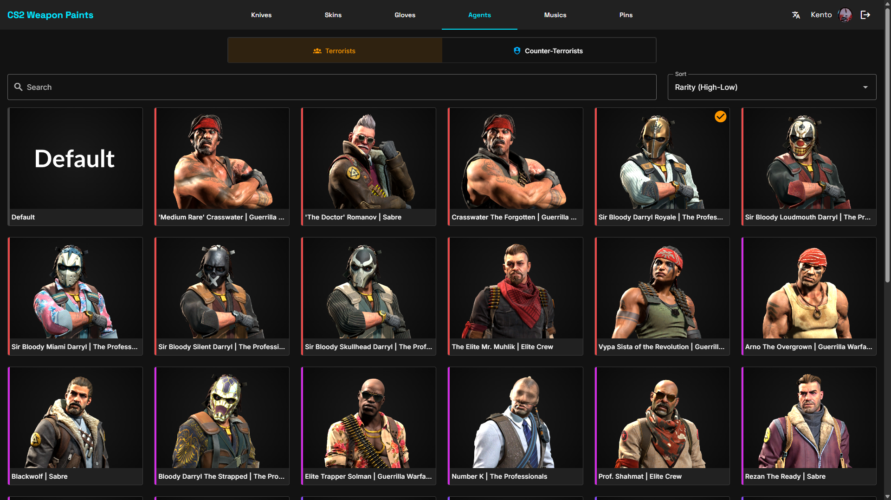
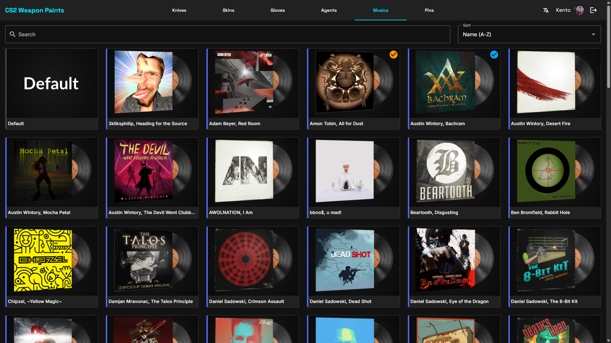
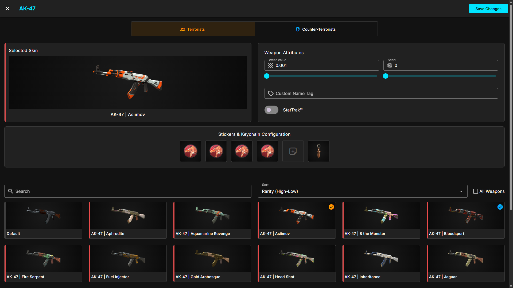

# CS2 Weapon Paints Web
A simple web interface for the [cs2-WeaponPaints](https://github.com/Nereziel/cs2-WeaponPaints/) plugin.

## Features
- Knives
- Skins
- Gloves
- Agents
- Music Kits
- i18n Support, `en` `zh-TW` are available.

**Note: It is possible to apply any skin to any weapon (e.g., "P90 | Fade", "AK-47 | Gamma Doppler").**

## Screenshots
  

  



## Installation

### Standard Setup
1. Download the [latest release](https://github.com/rogeraabbccdd/CS2-WeaponPaints-Web/archive/refs/heads/main.zip).
2. Edit `class/config.php` with your database and Steam API settings.
3. Upload the files to your web server (PHP 8.1+ and Apache/Nginx are recommended).
4. If you are not a developer, you can safely delete the `.vscode`, `screenshots`, `vhost.conf`, `docker-compose.yml`, and `Dockerfile` files.

### Docker
1. Download the [latest release](https://github.com/rogeraabbccdd/CS2-WeaponPaints-Web/archive/refs/heads/main.zip).
2. Edit `class/config.php` with your database and Steam API settings.
3. Edit `docker-compose.yml`.
4. Start the container:
   ```bash
   docker-compose up -d
   ```
5. Access the site via `http://localhost:8082` (or the port defined in `docker-compose.yml`).
6. If you are not a developer, you can safely delete the `.vscode`, `screenshots` files.

## Credits
- [Nereziel](https://github.com/Nereziel) - For the plugin and original web skin logic.
- [SmItH197](https://github.com/SmItH197/SteamAuthentication) - For the Steam Authentication PHP library.
- [Whethally](https://github.com/Whethally)- For Docker support and fiexes.
