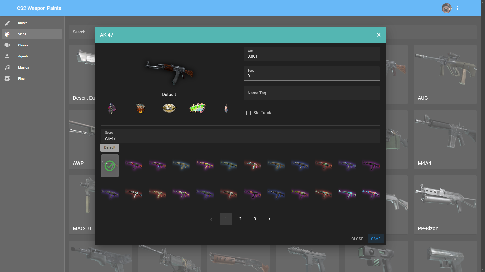

# CS2 Weapon Paints Web
A simple website to use [cs2-WeaponPaints](https://github.com/Nereziel/cs2-WeaponPaints/) plugin.

## Features
- Knifes
- Skins
- Gloves
- Agents
- Music Kits  

**You can set every skins on every weapons, such as "P90 Fade", "AK-47 Gamma Doppler".**

## Screenshots
  
  

## Credits
- [Nereziel](https://github.com/Nereziel) - Some codes are from default weapon skins website.
- [SmItH197](https://github.com/SmItH197/SteamAuthentication) - Steam Authentication PHP functions and files.
